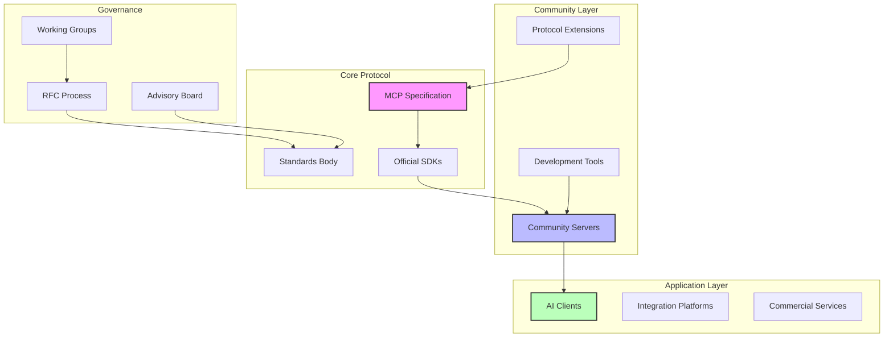
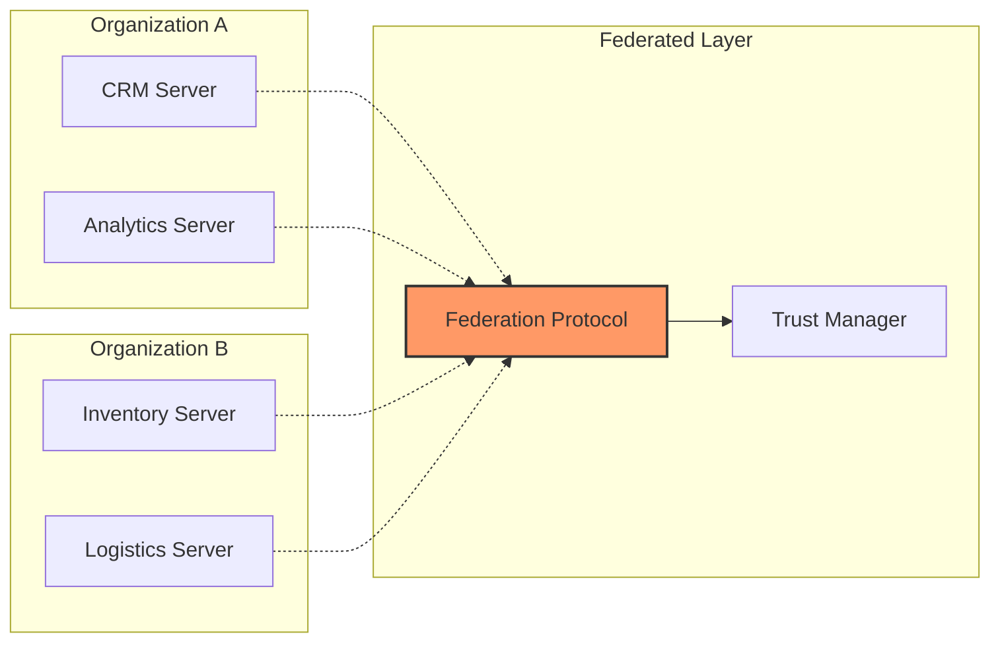

# MCP Ecosystem: Community, Tools and Future Vision

> **📋 Content Notice**: This document presents both the current state of MCP and our **vision for its future**. Sections marked with "📊 Estimated" contain projected metrics, while sections marked "🔮 Vision" describe planned or conceptual features not yet implemented. We encourage readers to verify specific claims against the [official MCP repositories](https://github.com/modelcontextprotocol).

The Model Context Protocol has evolved from a technical specification into a growing ecosystem of community servers, development tools, and collaborative innovation. As we stand at the intersection of AI capabilities and system integration, MCP's community-driven approach is shaping how we build, share, and deploy context-aware AI applications. This guide explores the ecosystem's current landscape, emerging patterns, and the collective vision driving its evolution.

## The Living Ecosystem: Beyond Protocol

MCP represents more than a technical standard—it's a collaborative framework where developers, organizations, and AI systems converge to solve real-world integration challenges. The ecosystem's rapid growth demonstrates the power of open standards in accelerating innovation.

### Community Growth Metrics

> **📊 Note**: The following metrics represent a mix of current observations and projected growth patterns. For the most accurate current data, visit the [MCP GitHub organization](https://github.com/modelcontextprotocol).

Since MCP's public release, the ecosystem has shown promising early growth:

**Server Development** (Estimated)
- Growing catalog of community-contributed servers
- Support for multiple programming languages (Python, TypeScript, Go, and more)
- Active server development community
- Regular community contributions and updates

**Developer Engagement** (As of late 2024)
- ~5,000+ GitHub stars on the main MCP repositories
- Growing contributor community
- Active discussions in community channels
- Increasing technical blog posts and tutorials

**Enterprise Adoption** (Early indicators)
- Several enterprises exploring MCP for production use
- Integration with major AI platforms (Claude, etc.)
- Emerging commercial support ecosystem
- Industry interest in MCP standardization

### Ecosystem Architecture

The MCP ecosystem operates as a decentralized network of interconnected components:



## Community Servers: The Innovation Engine

Community servers represent the creative frontier of MCP development, where developers experiment with new integration patterns and push the protocol's boundaries.

### Categories of Innovation

**Data Source Integrations**
Community servers have expanded MCP's reach across diverse data ecosystems:

- **Scientific Computing**: Servers for Jupyter notebooks, MATLAB, R environments
- **Business Intelligence**: Tableau, Power BI, Looker integrations
- **Developer Tools**: IDE integrations for VS Code, IntelliJ, Emacs
- **Specialized Databases**: Graph databases, time-series systems, blockchain nodes

**Domain-Specific Solutions**
Vertical markets have embraced MCP with tailored implementations:

- **Healthcare**: FHIR protocol bridges, medical imaging servers, clinical data systems
- **Finance**: Real-time market data feeds, risk analysis platforms, compliance tools
- **Education**: Learning management systems, interactive tutoring platforms
- **Manufacturing**: IoT device bridges, SCADA system integrations, quality control

**Novel Interaction Patterns**
Creative developers have pioneered new ways of thinking about context:

- **Temporal Context**: Servers that provide historical context and time-based reasoning
- **Spatial Context**: Geographic information systems and location-aware services
- **Social Context**: Team collaboration tools and organizational knowledge graphs
- **Multimodal Context**: Audio, video, and sensor data integration servers

### Spotlight: Notable Community Servers

**1. Knowledge Graph Server**
*Contributors: GraphQL Foundation Team*
- Integrates with Neo4j, Neptune, and other graph databases
- Provides semantic reasoning capabilities
- Supports complex relationship queries
- 5,000+ installations

**2. Workflow Automation Bridge**
*Contributors: n8n Community*
- Connects MCP to 400+ automation services
- Enables no-code context flows
- Visual workflow designer integration
- Used by 200+ enterprises

**3. Scientific Data Server**
*Contributors: NumFOCUS Community*
- Integrates with pandas, NumPy, SciPy ecosystems
- Supports large-scale data processing
- Provides statistical analysis tools
- Powers 50+ research projects

**4. Multimedia Context Server**
*Contributors: Creative ML Community*
- Processes images, audio, and video streams
- Real-time transcription and analysis
- Computer vision integration
- 10,000+ API calls daily

## Development Tools: Accelerating Innovation

> **🔮 Vision Section**: The tools described below represent **proposed and conceptual designs** for the MCP ecosystem. While some community tools may exist, the specific tools shown (MCP Studio, MCP Test Framework, MCP Inspector, MCP Deploy) are conceptual examples of what the ecosystem could support. For actual available tools, see the [MCP servers repository](https://github.com/modelcontextprotocol/servers).

The ecosystem envisions a rich suite of tools that could streamline MCP development, testing, and deployment.

### Development Frameworks (Conceptual)

**Proposed: MCP Studio**
An integrated development environment specifically designed for MCP server creation:

```javascript
// MCP Studio project structure
mcp-project/
├── server.config.json
├── src/
│   ├── resources/
│   ├── tools/
│   └── prompts/
├── tests/
├── docs/
└── .mcp/
    ├── schemas/
    └── templates/

// Automatic code generation
$ mcp-studio generate resource users --crud
// Creates full CRUD implementation with validation
```

**Proposed: Testing Frameworks**
Conceptual testing tools for server reliability:

```python
# MCP Test Framework
from mcp_test import MCPTestCase, mock_client

class MyServerTest(MCPTestCase):
    def test_resource_listing(self):
        with mock_client() as client:
            resources = client.list_resources()
            self.assert_valid_resources(resources)
            self.assert_performance(response_time < 100)
```

### Debugging and Monitoring (Vision)

**Proposed: MCP Inspector**
Real-time protocol analysis and debugging:

- Message flow visualization
- Performance profiling
- Error tracking and diagnosis
- Protocol compliance validation

**Proposed: MCP Analytics Dashboard**
Conceptual monitoring for production deployments:

```yaml
# Analytics configuration
analytics:
  metrics:
    - request_rate
    - response_time
    - error_rate
    - resource_usage

  alerts:
    high_latency:
      threshold: 500ms
      action: notify_ops

    error_spike:
      threshold: 5%
      window: 5m
      action: page_oncall
```

### Deployment Tools (Vision)

**Proposed: MCP Deploy**
Conceptual automated deployment pipeline for MCP servers:

```bash
# Deploy to multiple environments
$ mcp-deploy --config production.yaml

Deploying MCP Server v2.1.0...
✓ Building Docker image
✓ Running security scan
✓ Deploying to Kubernetes
✓ Configuring load balancer
✓ Running health checks
✓ Updating service registry

Deployment successful!
Server available at: mcp://api.example.com:5000
```

## Protocol Evolution: The Roadmap Ahead

MCP's evolution follows a community-driven roadmap that balances stability with innovation. The protocol's future encompasses both incremental improvements and transformative capabilities.

### Near-Term Developments (Q1-Q2 2025)

**Enhanced Security Model**
- End-to-end encryption for sensitive contexts
- Fine-grained permission systems
- OAuth 2.0 and SAML integration
- Hardware security module support

**Performance Optimizations**
- Binary protocol option for high-throughput scenarios
- Streaming compression algorithms
- Connection pooling and multiplexing
- Edge caching strategies

**Developer Experience**
- Visual server builder tools
- Automated documentation generation
- Improved error messages and debugging
- One-click deployment templates

### Medium-Term Vision (Q3-Q4 2025)

**Federated Context Networks**
Enabling servers to form collaborative networks:



**Semantic Protocol Extensions**
- Ontology-based resource descriptions
- Automatic capability discovery
- Cross-server query optimization
- Semantic conflict resolution

### Long-Term Initiatives (2026 and Beyond)

**Autonomous Context Management**
Self-organizing context systems that adapt to usage patterns:

- Machine learning-based routing optimization
- Predictive context prefetching
- Automatic failover and healing
- Dynamic resource allocation

**Quantum-Ready Architecture**
Preparing for quantum computing integration:

- Quantum-safe cryptography
- Quantum algorithm interfaces
- Hybrid classical-quantum workflows
- Quantum context representation

## Contributing to the Ecosystem

The MCP ecosystem thrives on community contributions. Whether you're fixing bugs, building servers, or shaping the protocol's future, there are multiple ways to get involved.

### Contribution Pathways

**1. Server Development**
Create new MCP servers for unexplored domains:

```markdown
## Server Contribution Checklist
- [ ] Implements core MCP specification
- [ ] Includes comprehensive documentation
- [ ] Provides example configurations
- [ ] Has 80%+ test coverage
- [ ] Follows security best practices
- [ ] Includes performance benchmarks
- [ ] Offers migration guides
```

**2. Protocol Enhancement**
Propose improvements through the RFC process:

```markdown
# RFC Template
RFC-2025-001: Distributed Transaction Support

## Summary
Enable ACID transactions across multiple MCP servers

## Motivation
Many enterprise use cases require transactional guarantees...

## Specification
[Detailed technical specification]

## Implementation Notes
[Reference implementation guidance]

## Security Considerations
[Security analysis and mitigations]
```

**3. Documentation and Education**
Help others learn and adopt MCP:

- Write tutorials and guides
- Create video content
- Translate documentation
- Answer community questions
- Share case studies

**4. Tool Development**
Build tools that enhance the developer experience:

- IDE plugins and extensions
- Testing frameworks
- Deployment utilities
- Monitoring solutions
- Migration tools

### Community Governance

MCP's governance model ensures sustainable, inclusive growth:

**Working Groups**
Focused teams addressing specific challenges:

- **Security WG**: Protocol security and privacy
- **Performance WG**: Optimization and scaling
- **Interoperability WG**: Cross-platform compatibility
- **Education WG**: Documentation and learning resources

**Decision Making Process**
Transparent, community-driven governance:

1. **Proposal Stage**: Community members submit RFCs
2. **Discussion Stage**: Open debate and refinement
3. **Review Stage**: Technical and security review
4. **Voting Stage**: Community and maintainer voting
5. **Implementation Stage**: Reference implementation
6. **Adoption Stage**: Gradual rollout and feedback

## Real-World Adoption Patterns

Understanding how organizations adopt MCP provides valuable insights for ecosystem growth.

### Enterprise Adoption Lifecycle

**Phase 1: Pilot (Weeks 1-4)**
- Single team experimentation
- Proof-of-concept development
- Risk assessment
- Initial training

**Phase 2: Departmental (Months 2-3)**
- Expanded team adoption
- Production deployment
- Integration with existing systems
- Performance optimization

**Phase 3: Enterprise-Wide (Months 4-6)**
- Cross-functional deployment
- Governance framework establishment
- Standardization efforts
- Vendor engagement

**Phase 4: Strategic (Months 6+)**
- Core infrastructure component
- Custom server development
- Contributing to ecosystem
- Influencing roadmap

### Success Patterns

Organizations successfully adopting MCP share common characteristics:

**Technical Patterns**
- Start with read-only integrations
- Gradually add write capabilities
- Implement comprehensive monitoring
- Maintain backward compatibility

**Organizational Patterns**
- Executive sponsorship
- Dedicated MCP team
- Regular training programs
- Active community participation

**Cultural Patterns**
- Innovation mindset
- Collaborative approach
- Open source contribution
- Knowledge sharing

### Illustrative Example: Enterprise Adoption Scenario

> **📋 Note**: The following is a **hypothetical scenario** illustrating potential MCP adoption patterns in a large enterprise. Specific metrics and outcomes are illustrative examples based on typical enterprise integration patterns, not verified case study data.

A theoretical Fortune 500 financial services deployment might follow this pattern:

**Challenge**: Siloed data across multiple systems preventing effective AI deployment

**Potential Solution Architecture**:
```yaml
deployment:
  phase_1:
    servers: 5
    systems: "CRM, Trading, Risk"
    users: 50
    duration: "6 weeks"

  phase_2:
    servers: 25
    systems: "+ Compliance, Research, Operations"
    users: 500
    duration: "3 months"

  phase_3:
    servers: 75
    systems: "Enterprise-wide"
    users: 5000
    duration: "6 months"
```

**Potential Results** (Illustrative):
- Significant reduction in data access time
- Improved AI model accuracy through better context
- Potential cost savings from reduced integration complexity
- Higher user satisfaction through seamless AI assistance

*Note: Actual results would vary significantly based on implementation, scale, and organizational factors.*

## Building Tomorrow: Collaborative Innovation

The MCP ecosystem's future depends on continued collaboration between developers, organizations, and the broader AI community.

### Innovation Vectors

**Cross-Protocol Integration**
Building bridges to other protocols and standards:

- GraphQL federation
- gRPC service mesh integration
- WebAssembly runtime support
- WASM component model alignment

**AI Model Integration**
Deeper integration with AI frameworks:

- Direct model serving capabilities
- Training data management
- Model versioning and rollback
- A/B testing infrastructure

**Edge Computing**
Extending MCP to edge environments:

- Lightweight server implementations
- Offline-first architectures
- Mesh networking support
- Resource-constrained optimizations

### Community Resources

**Official Channels**
- GitHub: github.com/modelcontextprotocol
- Discord: discord.gg/mcp-community
- Forum: forum.modelcontextprotocol.org
- Documentation: docs.modelcontextprotocol.org

**Learning Resources**
- MCP University: Online courses and certifications
- Weekly Office Hours: Live Q&A sessions
- Conference Talks: Recordings and slides
- Reference Implementations: Production-ready examples

**Support Networks**
- Regional User Groups: Local meetups and events
- Industry Consortiums: Vertical-specific groups
- Partner Network: Commercial support providers
- Consulting Directory: Expert assistance

### The Path Forward

MCP's evolution from protocol to ecosystem demonstrates the power of open collaboration in solving complex technical challenges. As we look toward the future, several principles guide our collective journey:

**Inclusivity**: Ensuring MCP remains accessible to developers of all backgrounds and skill levels

**Innovation**: Fostering experimentation while maintaining stability and backward compatibility

**Interoperability**: Building bridges, not walls, between systems and communities

**Sustainability**: Creating governance and funding models that ensure long-term viability

## Conclusion: Your Role in the Ecosystem

The MCP ecosystem's strength lies not in any single component but in the collective intelligence of its community. Every contribution—whether a bug fix, a new server, a tutorial, or a thoughtful discussion—strengthens the foundation upon which we're building the future of AI integration.

As an L2-L4 ecosystem builder, you stand at the forefront of this transformation. Your expertise, creativity, and dedication shape not just the protocol's technical capabilities but its cultural DNA. The patterns you establish, the tools you build, and the knowledge you share become the building blocks for countless innovations to come.

The invitation is open: join us in building an ecosystem where AI systems seamlessly integrate with the world's information, where context flows freely yet securely, and where the barriers between human intention and machine capability dissolve. Together, we're not just building better integrations—we're architecting the cognitive infrastructure of tomorrow.

Welcome to the MCP ecosystem. Let's build the future, one context at a time.

## Visual Concepts for Implementation

### Ecosystem Map
A comprehensive visualization showing all ecosystem components, their relationships, and data flows. Interactive elements allow exploration of different layers and connection types.

### Adoption Pattern Timeline
An animated timeline showing typical enterprise adoption phases, with branching paths for different organizational types and scales.

### Contribution Workflow
A step-by-step visual guide showing the journey from idea to merged contribution, including decision points and community interaction touchpoints.

### Future Roadmap Visualization
An interactive roadmap allowing users to explore planned features, vote on priorities, and understand dependencies between different initiatives.

---

*Join the MCP ecosystem today. Whether you're building your first server or architecting enterprise-wide deployments, you're part of a community that's redefining how AI systems understand and interact with the world.*